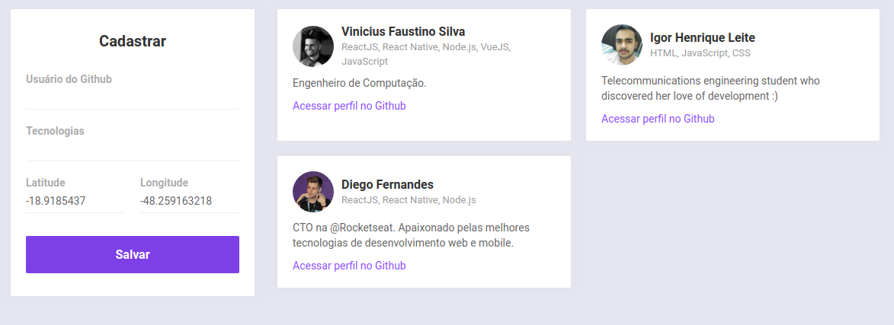
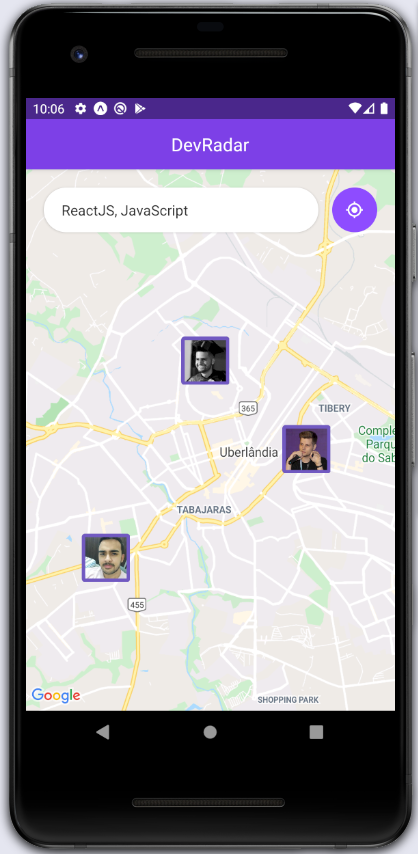

# Semana Omnistack #10 | Rocketseat

- Desenvolvimento de uma aplicação utilizando a stack **Node.js**, **ReactJS** e **React Native**.
- A aplicação tem por intuito apresentar os devs que trabalham com determinada tecnologia e estão em um determinado raio da área do usuário.
- Na interface web é possível cadastrar seu perfil, informando usuário do github, onde as demais informações serão buscadas, tecnologias, latitude e longitude de onde está, as quais são preenchidas automaticamente utilizando a api de _geolocalização_ do navegador.
- Na aplicação mobile, é possível procurar pelos devs por perto que se encaixam nas tecnologias que forem escolhidas.
- Através de um _websocket_ foi feita a comunicação cliente/servidor em tempo real.

### Telas

- Interface Web: cadastro de usuários.

<h1 align="center">
  
</h1>

- Interface Mobile: pesquisar devs por tecnologia e localização.

<h1 align="center">
  
</h1>
